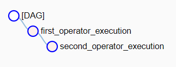

# Apache Airflow Template

<br>


## Introduction
Airflow is a Python-based workflow management tool for data engineering pipelines.
It simplifies the development, deployment, and monitoring of data pipelines by using
DAGs. Visit [Airflow documentation](https://airflow.apache.org/docs/apache-airflow/stable/index.html) for more information.

This is a template project to use Apache Airflow for scheduling and monitoring workflows.
It covers how DAGs and operators are defined, scheduled, and run using Airflow.
The deployment is also included using Docker Compose which also creates a separate container
for PostgreSQL database.

## Deployment

### Build
Run the following command to build/re-build the project using Docker:
```
docker compose up -d --build
```

### Start
Run the following command to start the project when it's already built:
```
docker compose up
```

## Usage

### Airflow UI
After deployment, visit the following link in your browser to access the Airflow UI:

localhost:8080

### DAGs

